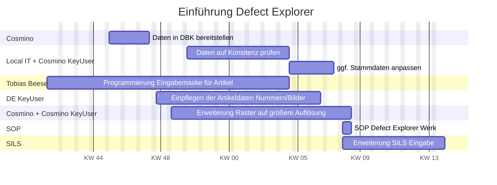

```mermaid
gantt
  title Einführung Defect Explorer
  dateFormat  YYYY-MM-DD
  excludes    weekends
  axisFormat KW %W

  section Cosmino
  Daten in DBK bereitstellen :2021-11-08, 2w

  section Local IT + Cosmino KeyUser
  Daten auf Konsitenz prüfen :local1, 2021-12-13, 2022-01-28
  ggf. Stammdaten anpassen :after local1, 2w

  section Tobias Beese
  Programmierung Eingabemaske für Artikel :2021-10-11, 2022-01-28

  section DE KeyUser
  Einpflegen der Artikeldaten Nummern/Bilder :2021-11-29, 2022-02-11

  section Cosmino + Cosmino KeyUser
  Erweiterung Raster auf größere Auflösung :2021-12-06, 2022-02-25

  section SOP
  SOP Defect Explorer Werk :2022-02-21, 2022-02-25

  section SILS
  Erweiterung SILS Eingabe :2022-02-21, 2022-04-08
```
